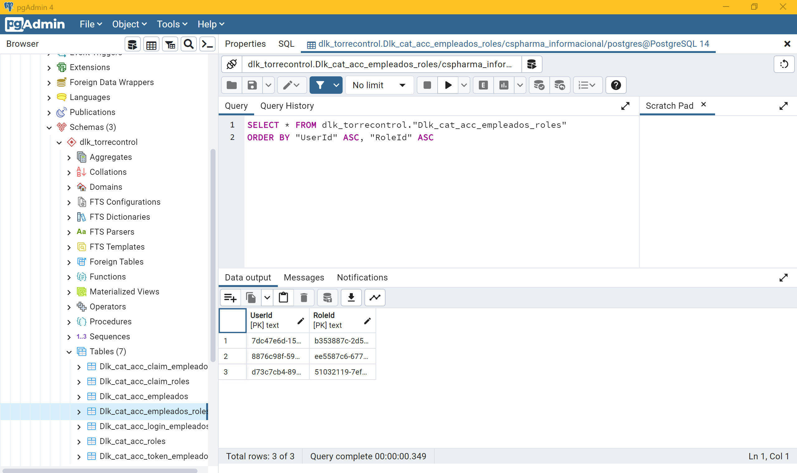

# CSPharma-v4.3.0

- [CSPharma-v4.3.0](#cspharma-v430)
  - [Introducción](#introducción)
- [1. Live Search Bar con Jquery](#1-live-search-bar-con-jquery)
- [Prueba de Ejecución 1 - Live Search Bar](#prueba-de-ejecución-1---live-search-bar)
- [2. Autoasignar rol al registrar nuevo usuario](#2-autoasignar-rol-al-registrar-nuevo-usuario)
- [Prueba de Ejecución 2 - Autoasignar rol al registrar nuevo usuario](#prueba-de-ejecución-2---autoasignar-rol-al-registrar-nuevo-usuario)
- [3. CRUD de usuarios - Gestión de roles](#3-crud-de-usuarios---gestión-de-roles)
  - [3.0. Repositorios](#30-repositorios)
    - [3.0.1. Repositories --\> Interfaces --\> IUserRepository.cs](#301-repositories----interfaces----iuserrepositorycs)
    - [3.0.2. Repositories --\> Interfaces --\> IRoleRepository.cs](#302-repositories----interfaces----irolerepositorycs)
    - [3.0.3. Repositories --\> Interfaces --\> IUnitOfWork.cs](#303-repositories----interfaces----iunitofworkcs)
    - [3.0.4. Repositories --\> Implementations --\> UserRepository.cs](#304-repositories----implementations----userrepositorycs)
    - [3.0.5. Repositories --\> Implementations --\> RoleRepository.cs](#305-repositories----implementations----rolerepositorycs)
    - [3.0.6. Repositories --\> Implementations --\> UnitOfWork.cs](#306-repositories----implementations----unitofworkcs)
    - [3.0.7 AddScope() en el Program.cs](#307-addscope-en-el-programcs)
    - [Preparativos Extras](#preparativos-extras)
  - [3.1. Listar usuarios](#31-listar-usuarios)
    - [3.1.1. GestionUsuarios --\> Index.cshtml.cs](#311-gestionusuarios----indexcshtmlcs)
    - [3.1.2. GestionUsuarios --\> Index.cshtml](#312-gestionusuarios----indexcshtml)
  - [3.2. Eliminar usuario](#32-eliminar-usuario)
    - [3.2.1. GestionUsuarios --\> Delete.cshtml.cs](#321-gestionusuarios----deletecshtmlcs)
    - [3.2.2. GestionUsuarios --\> Delete.cshtml](#322-gestionusuarios----deletecshtml)
  - [3.3. Editar Usuario (gestión de roles)](#33-editar-usuario-gestión-de-roles)
    - [3.3.1. GestionUsuarios --\> Edit.cshtml.cs](#331-gestionusuarios----editcshtmlcs)
    - [3.3.2. GestionUsuarios --\> Edit.cshtml](#332-gestionusuarios----editcshtml)
- [Prueba de Ejecución 3 - CRUD de usuarios y Gestión de Roles](#prueba-de-ejecución-3---crud-de-usuarios-y-gestión-de-roles)


## Introducción

En esta continuación de la v4.2.2, vamos a añadir una pantalla de administración de usuarios (CRUD) con acciones de asignación de rol y eliminar usuario.

Por otro lado, añadiremos la funcionalidad de que cuando un nuevo usuario se registre, se le autoasignará el rol básico de Users.

Finalmente, también se implementará una barra de búsqueda en directo sobre los demás CRUDs de las entidades de la primera versión.

# 1. Live Search Bar con Jquery

Empezamos por aquí porque es lo más sencillo y rápido de implementar.

Tan sólo tenemos que ir a alguno de los Index de nuestros CRUDs y añadir un input identificado por el campo que queramos buscar: <input type="text" id="searchId" placeholder="buscar por ID" />


```html
<input type="text" id="searchId" placeholder="buscar por ID" />
```

Abajo de toda la página, importamos la librería de Jquery (ya sea a través de la librería estática por defecto que nos trae el proyecto, o buscando nosotros mismos el CDN de Jquery).

```html
<script src="~/lib/jquery/dist/jquery-3.6.3.min.js" asp-append-version="true"></script>

<script src="https://ajax.googleapis.com/ajax/libs/jquery/3.6.3/jquery.min.js"></script>
```

Finalmente, añadimos el siguiente `<script>` debajo de la importación de Jquery:

```js
<script>
    $("#searchId").on("keyup", function () {
        var inputSearch = $(this).val();

        $("table tr").each(function (results) {
            if (results !== 0) {
                var search = $(this).find("td:nth-child(3)").text(); // nth-child(3) --> Id

                if (search.indexOf(inputSearch) !== 0 && search.toLowerCase().indexOf(inputSearch.toLowerCase()) < 0) {
                    $(this).hide();
                }
                else {
                    $(this).show();
                }
            }
        });
    });
</script>
```

# Prueba de Ejecución 1 - Live Search Bar

Para filtrar por cualquier otro campo, tan sólo tendríamos que replicar este script cambiando el identificador por id del input, y la posición que ocupa el campo por el cual queremos filtrar.

[Prueba de Ejecución 1](https://user-images.githubusercontent.com/91122596/217490957-fd701d87-2f46-4c7e-a13f-67e40c31d677.mp4)

# 2. Autoasignar rol al registrar nuevo usuario

Para conseguir esta parte, he tenido que deshacer algunos cambios del sprint anterior...

Haciendo un poco de memoria, en el sprint 2, el profesor nos pidió que creásemos tres roles en la BBDD.

ID --> ROL
- 0 --> Administrators
- 1 --> Employees
- 2 --> Users

Entonces yo los introduje en la BBDD manualmente.

Después registré a tres usuarios.

Y finalmente fui a la tabla relacional de identity de Dlk_cat_acc_empleados_roles (AspNetUsersRoles) a relacionar manualmente los tres roles con los tres usuarios.

- 0 --> Administrators --> sergio
- 1 --> Employees --> moises
- 2 --> Users --> javier

El problema que me he encontrado de primeras a la hora de hacer este nuevo punto, es que si un desarrollador introduce manualmente los roles en la BBDD, después la clase RoleManager no es capaz de identificarlos.

Es decir, RoleManager necesita crear él mismo los roles para poder después manejarlos.

Entonces, para respetar los roles que tenía definidos en mis tres usuarios, y dejar esta parte lista para que los nuevos usuarios que se registren se les autoasigne el rol de Users, he hecho el siguiente truco...

He eliminado en la BBDD los tres usuarios que tenía y los tres roles que introduje manualmente.

Después, en el código del método OnPostAsync() del Register.cshtml.cs he añadido la parte nueva de gestión de roles con RoleManager, para que en la siguiente ejecucuión de mi proyecto, RoleManager cree el rol de Administrators, y el siguiente usuario que se registre (sergio) se le asigne el rol de administrador.

Registro al usuario sergio y efectivamente se le asigna el rol Administrators.

Cierro la ejecución del proyecto y voy de nuevo al método OnPostAsync() del Register.cshtmml.cs para que ahora cree el rol de Employees, y ejecuto otra vez el proyecto y registro al usuario moises.

Finalmente cierro de nuevo el proyecto, para ahora en el Register dejar definido definitivamente que todo usuario nuevo que se registre se le asigne el rol Users.

Ejecuto una tercera vez el proyecto y ahora registro al usuario de javier.

Y ya estaría hecho este punto. A partir de ahora todo nuevo usuario que se registre se el autoasignará el rol básico de Users.

```csharp
public async Task<IActionResult> OnPostAsync(string returnUrl = null)
        {
            returnUrl ??= Url.Content("~/");
            ExternalLogins = (await _signInManager.GetExternalAuthenticationSchemesAsync()).ToList();
            if (ModelState.IsValid)
            {
                var user = CreateUser();
                
                await _userStore.SetUserNameAsync(user, Input.Email, CancellationToken.None);
                await _emailStore.SetEmailAsync(user, Input.Email, CancellationToken.None);
                var result = await _userManager.CreateAsync(user, Input.Password);

                if (result.Succeeded)
                {
                    _logger.LogInformation("User created a new account with password.");

                    /******************************** to assign default role ************************************/
                    // forma 1 --> no funciona: El rol USERS no se encuentra en la bbdd
                    /*
                    var defaultRole = _roleManager.FindByIdAsync("2").Result;

                    if (defaultRole != null)
                    {
                        await _userManager.AddToRoleAsync(user, defaultRole.Name);
                    }
                    */

                    // forma 1 --> no funciona: encuentra el rol pero no lo asigna al usuario
                    /*
                    var roleExist = await _roleManager.RoleExistsAsync("Users");
                    
                    if (roleExist)
                    {
                        await _userManager.AddToRoleAsync(user, "Users");
                    }
                    */

                    // forma 3 --> SÍ funciona: primero creamos el rol y después lo asignamos
                    // explicación: para que RoleManager identifique los roles de la bbdd,
                    // es necesario que sea él mismo quien los cree, porque si los creo yo manualmente, ya no se reconocen
                    // https://stackoverflow.com/questions/70559504/invalidoperationexception-role-admin-does-not-exist
                    var roleExist = await _roleManager.RoleExistsAsync("Users");
                    
                    if (!roleExist)
                    {
                        await _roleManager.CreateAsync(new IdentityRole("Users"));
                    }

                    await _userManager.AddToRoleAsync(user, "Users");

                    /*********************************************************************************************/
                    var userId = await _userManager.GetUserIdAsync(user);
                    var code = await _userManager.GenerateEmailConfirmationTokenAsync(user);
                    code = WebEncoders.Base64UrlEncode(Encoding.UTF8.GetBytes(code));
                    var callbackUrl = Url.Page(
                        "/Account/ConfirmEmail",
                        pageHandler: null,
                        values: new { area = "Identity", userId = userId, code = code, returnUrl = returnUrl },
                        protocol: Request.Scheme);

                    await _emailSender.SendEmailAsync(Input.Email, "Confirm your email",
                        $"Please confirm your account by <a href='{HtmlEncoder.Default.Encode(callbackUrl)}'>clicking here</a>.");

                    if (_userManager.Options.SignIn.RequireConfirmedAccount)
                    {
                        return RedirectToPage("RegisterConfirmation", new { email = Input.Email, returnUrl = returnUrl });
                    }
                    else
                    {
                        await _signInManager.SignInAsync(user, isPersistent: false);
                        return LocalRedirect(returnUrl);
                    }
                }
                foreach (var error in result.Errors)
                {
                    ModelState.AddModelError(string.Empty, error.Description);
                }
            }

            // If we got this far, something failed, redisplay form
            return Page();
        }
```




# Prueba de Ejecución 2 - Autoasignar rol al registrar nuevo usuario

[Prueba de Ejecución 2](https://user-images.githubusercontent.com/91122596/218782404-f590b032-db84-4b18-9fb9-2d9770e2893d.mp4)

# 3. CRUD de usuarios - Gestión de roles

Vamos a crear una nueva carpeta en Pages llamada *GestionUsuarios*, a la cual le agregaremos las vistas razor vacías para el Index, el Delete y el Edit.

## 3.0. Repositorios

Antes de empezar con el CRUD en los controladores, necesitamos las funcionalidades del mismo. 
Para ello vamos a crear los repositorios correspondientes.

### 3.0.1. Repositories --> Interfaces --> IUserRepository.cs

```csharp
public interface IUserRepository
{
    ICollection<ApplicationUser> GetUsers();
    ApplicationUser GetUser(string id);
    ApplicationUser UpdateUser(ApplicationUser user);
}
```

### 3.0.2. Repositories --> Interfaces --> IRoleRepository.cs

```csharp
public interface IRoleRepository
{
    ICollection<IdentityRole> GetRoles();
}
```

### 3.0.3. Repositories --> Interfaces --> IUnitOfWork.cs

```csharp
public interface IUnitOfWork
{
    IUserRepository User { get; }
    IRoleRepository Role { get; }
}
```

### 3.0.4. Repositories --> Implementations --> UserRepository.cs

```csharp
public class UserRepository : IUserRepository
{
    private readonly LoginRegisterContext _loginRegisterContext;

    public UserRepository(LoginRegisterContext loginRegisterContext)
        {
        _loginRegisterContext = loginRegisterContext;
    }

    public ICollection<ApplicationUser> GetUsers()
    {
        return _loginRegisterContext.Users.ToList();
    }

    public ApplicationUser GetUser(string id)
    {
        return _loginRegisterContext.Users.FirstOrDefault(u => u.Id == id);
    }

    public ApplicationUser UpdateUser(ApplicationUser user)
    {
        _loginRegisterContext.Update(user);
        _loginRegisterContext.SaveChanges();

        return user;
    }
}
```

### 3.0.5. Repositories --> Implementations --> RoleRepository.cs

```csharp
public class RoleRepository : IRoleRepository
{
    private readonly LoginRegisterContext _loginRegisterContext;

    public RoleRepository(LoginRegisterContext loginRegisterContext)
    {
        _loginRegisterContext = loginRegisterContext;
    }

    public ICollection<IdentityRole> GetRoles()
    {
        return _loginRegisterContext.Roles.ToList();
    }
}
```

### 3.0.6. Repositories --> Implementations --> UnitOfWork.cs

```csharp
public class UnitOfWork : IUnitOfWork
    {
    public IUserRepository User { get; }

    public IRoleRepository Role { get; }

    public UnitOfWork(IUserRepository user, IRoleRepository role) 
    {
        User = user;
        Role = role;
    }
}
```

### 3.0.7 AddScope() en el Program.cs

```csharp
...
AddScope();
var app = builder.Build();
...
void AddScope()
{
    builder.Services.AddScoped<IUserRepository, UserRepository>();
    builder.Services.AddScoped<IRoleRepository, RoleRepository>();
    builder.Services.AddScoped<IUnitOfWork, UnitOfWork>();
}
```

### Preparativos Extras

**DbSet de usuarios en el contexto de Identity**

```csharp
...
public virtual DbSet<ApplicationUser> ApplicationUserSet { get; set; }
...
```

**Clase ApplicationRole**

```csharp
public class ApplicationRole : IdentityRole
{

}
```

**Models --> EditUserViewModel.cs**

```csharp
public class EditUserViewModel
{
    public ApplicationUser User { get; set; }
    public IList<SelectListItem> Roles { get; set; }
}
```

## 3.1. Listar usuarios

### 3.1.1. GestionUsuarios --> Index.cshtml.cs

```csharp
[Authorize(Roles = "Administrators")]
public class IndexModel : PageModel
{
    private readonly LoginRegisterContext _loginRegisterContext;

    public IndexModel(LoginRegisterContext loginRegisterContext)
    {
        _loginRegisterContext = loginRegisterContext;
    }

    public IList<ApplicationUser> ApplicationUserList { get; set; } = default!;

    public async Task OnGetAsync()
    {
        if (_loginRegisterContext.ApplicationUserSet != null)
        {
            ApplicationUserList = await _loginRegisterContext.ApplicationUserSet.ToListAsync();
        }
    }
}
```

### 3.1.2. GestionUsuarios --> Index.cshtml

```html
@page
@model CSPharma_v4._1.Pages.GestionUsuarios.IndexModel

@{
    ViewData["Title"] = "Index";
}

<link rel="stylesheet" href="~/css/site.css" asp-append-version="true" />

<div class="body">
    <h1>Index</h1>

    <table class="table">
        <thead>
            <tr>
                <th>
                    @Html.DisplayNameFor(model => model.ApplicationUserList[0].Id)
                </th>
                <th>
                    @Html.DisplayNameFor(model => model.ApplicationUserList[0].UserName)
                </th>
                <th>
                    @Html.DisplayNameFor(model => model.ApplicationUserList[0].Email)
                </th>
                <th>
                    @Html.DisplayNameFor(model => model.ApplicationUserList[0].PhoneNumber)
                </th>
                <th></th>
            </tr>
        </thead>
        <tbody>
            @foreach (var item in Model.ApplicationUserList)
            {
                <tr>
                    <td>
                        @Html.DisplayFor(modelItem => item.Id)
                    </td>
                    <td>
                        @Html.DisplayFor(modelItem => item.UserName)
                    </td>
                    <td>
                        @Html.DisplayFor(modelItem => item.Email)
                    </td>
                    <td>
                        @Html.DisplayFor(modelItem => item.PhoneNumber)
                    </td>
                    <td>
                        <a asp-page="./Edit" asp-route-id="@item.Id">Edit</a> |
                        <a asp-page="./Delete" asp-route-id="@item.Id">Delete</a>
                    </td>
                </tr>
            }
        </tbody>
    </table>
</div>
```

## 3.2. Eliminar usuario

### 3.2.1. GestionUsuarios --> Delete.cshtml.cs

```csharp
public class DeleteModel : PageModel
{
    private readonly LoginRegisterContext _loginRegisterContext;

    public DeleteModel(LoginRegisterContext loginRegisterContext)
    {
        _loginRegisterContext = loginRegisterContext;
    }

    [BindProperty]
    public ApplicationUser ApplicationUser { get; set; }

    public async Task<IActionResult> OnGetAsync(string id)
    {
        if (id == null || _loginRegisterContext.ApplicationUserSet == null)
        {
            return NotFound();
        }

        var applicationUser = await _loginRegisterContext.ApplicationUserSet.FirstOrDefaultAsync(m => m.Id == id);

        if (applicationUser == null)
        {
            return NotFound();
        }
        else
        {
            ApplicationUser = applicationUser;
        }
        return Page();
    }

    public async Task<IActionResult> OnPostAsync(string id)
    {
        if (id == null || _loginRegisterContext.ApplicationUserSet == null)
        {
            return NotFound();
        }
        var applicationUser = await _loginRegisterContext.ApplicationUserSet.FindAsync(id);

        if (applicationUser != null)
        {
            ApplicationUser = applicationUser;
            _loginRegisterContext.ApplicationUserSet.Remove(ApplicationUser);
            await _loginRegisterContext.SaveChangesAsync();
        }

        return RedirectToPage("./Index");
    }
}
```

### 3.2.2. GestionUsuarios --> Delete.cshtml

```html
@page
@model CSPharma_v4._1.Pages.GestionUsuarios.DeleteModel

@{
    ViewData["Title"] = "Delete";
}

<link rel="stylesheet" href="~/css/site.css" asp-append-version="true" />

<div class="body">
    <h1>Delete</h1>

    <h3>Are you sure you want to delete this?</h3>
    <div>
        <h4>ApplicationUser</h4>
        <hr />
        <dl class="row">
            <dt class="col-sm-2">
                @Html.DisplayNameFor(model => model.ApplicationUser.Id)
            </dt>
            <dd class="col-sm-10">
                @Html.DisplayFor(model => model.ApplicationUser.Id)
            </dd>
            <dt class="col-sm-2">
                @Html.DisplayNameFor(model => model.ApplicationUser.UserName)
            </dt>
            <dd class="col-sm-10">
                @Html.DisplayFor(model => model.ApplicationUser.UserName)
            </dd>
            <dt class="col-sm-2">
                @Html.DisplayNameFor(model => model.ApplicationUser.Email)
            </dt>
            <dd class="col-sm-10">
                @Html.DisplayFor(model => model.ApplicationUser.Email)
            </dd>
            <dt class="col-sm-2">
                @Html.DisplayNameFor(model => model.ApplicationUser.PhoneNumber)
            </dt>
            <dd class="col-sm-10">
                @Html.DisplayFor(model => model.ApplicationUser.PhoneNumber)
            </dd>
        </dl>

        <form method="post">
            <input type="hidden" asp-for="ApplicationUser.Id" />
            <input type="submit" value="Delete" class="btn btn-danger" /> |
            <a asp-page="./Index">Back to List</a>
        </form>
    </div>

</div>
```

## 3.3. Editar Usuario (gestión de roles)

### 3.3.1. GestionUsuarios --> Edit.cshtml.cs

```csharp
public class EditModel : PageModel
{
    private readonly IUnitOfWork _unitOfWork;
    private readonly SignInManager<ApplicationUser> _signInManager;

    public EditModel(IUnitOfWork unitOfWork, SignInManager<ApplicationUser> signInManager)
    {
        _unitOfWork = unitOfWork;
        _signInManager = signInManager;
    }

    [BindProperty]
    public EditUserViewModel UserModel { get; set; } = default!;


    public async Task<IActionResult> OnGetAsync(string id)
    {
        var user = _unitOfWork.User.GetUser(id);
        var roles = _unitOfWork.Role.GetRoles();

        var userRoles = await _signInManager.UserManager.GetRolesAsync(user);
           
        var roleItems = roles.Select(role =>
            new SelectListItem(
                role.Name,
                role.Id,
                userRoles.Any(ur => ur.Contains(role.Name))
            )
        ).ToList();

        var userModel = new EditUserViewModel
        {
            User = user,
            Roles = roleItems
        };

        UserModel = userModel;

        return Page();
    }


    public async Task<IActionResult> OnPostAsync(EditUserViewModel UserModel)
    {
        var user = _unitOfWork.User.GetUser(UserModel.User.Id);

        if (user == null)
        {
            return NotFound();
        }

        var userRolesInDb = await _signInManager.UserManager.GetRolesAsync(user);

        var rolesToAdd = new List<string>();
        var rolesToRemove = new List<string>();

        foreach (var role in UserModel.Roles)
        {
            var assignedInDb = userRolesInDb.FirstOrDefault(ur => ur == role.Text);

            if (role.Selected)
            {
                if (assignedInDb == null) 
                {
                    rolesToAdd.Add(role.Text);
                }
            }
            else
            {
                if (assignedInDb != null)
                {
                    rolesToRemove.Add(role.Text);
                }
            }
        }

        if (rolesToAdd.Any())
        {
            await _signInManager.UserManager.AddToRolesAsync(user, rolesToAdd);
        }
        if (rolesToRemove.Any())
        {
            await _signInManager.UserManager.RemoveFromRolesAsync(user, rolesToRemove);
        }

        user.UserName = UserModel.User.UserName;
        user.Email= UserModel.User.Email;
        user.PhoneNumber = UserModel.User.PhoneNumber;

        _unitOfWork.User.UpdateUser(user);

        return RedirectToPage("./Index");
    }
}
```

### 3.3.2. GestionUsuarios --> Edit.cshtml

```html
@page
@model CSPharma_v4._1.Pages.GestionUsuarios.EditModel

<link rel="stylesheet" href="~/css/site.css" asp-append-version="true" />

<div class="body">
    <div class="py-5 text-center">
        <h2>Edit User</h2>
    </div>

    <div class="row g-5">
        <div class="col-md-7 col-lg-8">

            @using (Html.BeginForm("OnPost", "User"))
            {
                @Html.HiddenFor(h => @Model.UserModel.User.Id);

                <div class="row g-3">
                    <div class="col-sm-6">
                        <label asp-for="UserModel.User.UserName" class="form-label"></label>
                        <input asp-for="UserModel.User.UserName" class="form-control" autocomplete="username" aria-required="true" />
                        <span asp-validation-for="UserModel.User.UserName" class="text-danger"></span>
                    </div>

                    <div class="col-12">
                        <label asp-for="UserModel.User.Email" class="form-label"></label>
                        <div class="input-group has-validation">
                            <span class="input-group-text"></span>
                            <input asp-for="UserModel.User.Email" class="form-control" autocomplete="username" aria-required="true" />
                            <span asp-validation-for="UserModel.User.Email" class="text-danger"></span>
                        </div>
                    </div>

                    <div class="col-sm-6">
                        <label asp-for="UserModel.User.PhoneNumber" class="form-label"></label>
                        <input asp-for="UserModel.User.PhoneNumber" class="form-control" autocomplete="username" aria-required="true" />
                        <span asp-validation-for="UserModel.User.PhoneNumber" class="text-danger"></span>
                    </div>
                </div>

                <hr class="my-4">

                <h4 class="mb-3">Roles</h4>

                <div class="my-3">
                    @for (int i = 0; i < @Model.UserModel.Roles.Count(); i++)
                    {
                        <div class="form-check">
                            @Html.CheckBoxFor(c => @Model.UserModel.Roles[i].Selected)
                            @Html.HiddenFor(h => @Model.UserModel.Roles[i].Value)

                            @Html.LabelFor(l => @Model.UserModel.Roles[i].Selected, @Model.UserModel.Roles[i].Text, new {@class="form-check-label"})
                            @Html.HiddenFor(h => @Model.UserModel.Roles[i].Text)
                        </div>
                    }

                </div>

                <hr class="my-4">

                <button asp-page-handler="Async" type="submit" class="w-100 btn btn-primary btn-lg" value="submit">Submit</button>
            }
        </div>
    </div>

    <div>
        <a asp-page="./Index">Back to List</a>
    </div>
</div>
```

# Prueba de Ejecución 3 - CRUD de usuarios y Gestión de Roles

[Prueba de Ejecución 3](https://user-images.githubusercontent.com/91122596/222569372-ca9de909-2e52-404e-9e82-a82a13d95d2d.mp4)